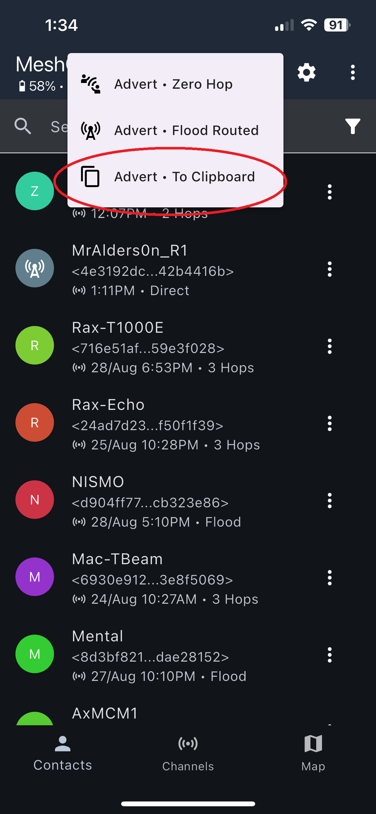
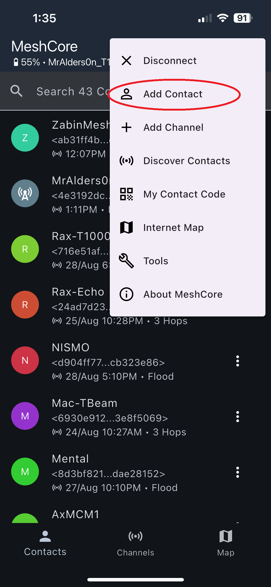
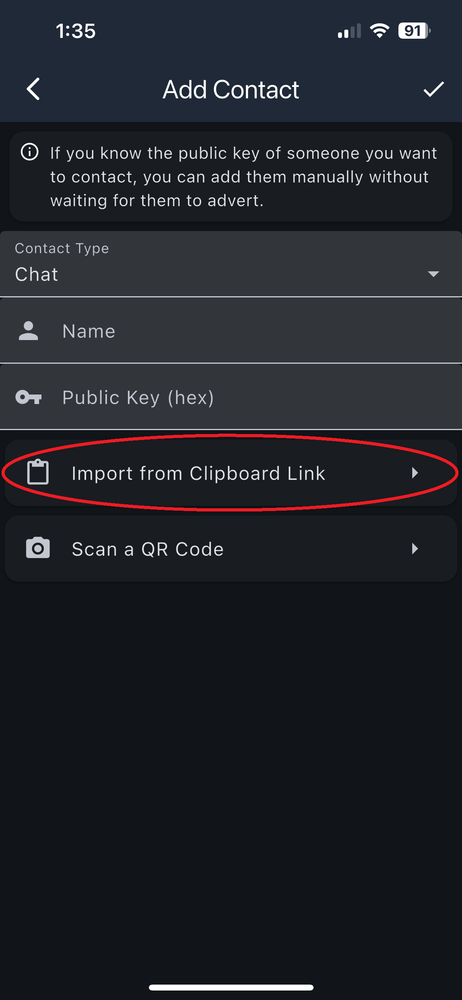
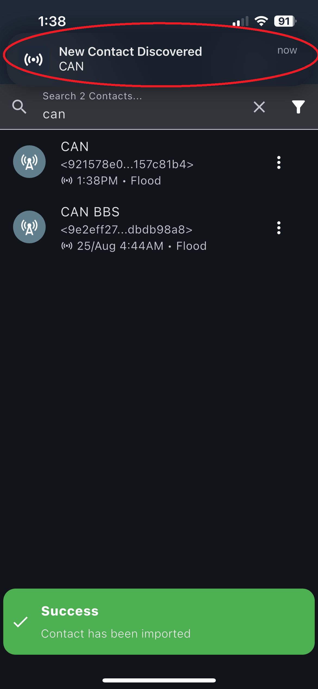
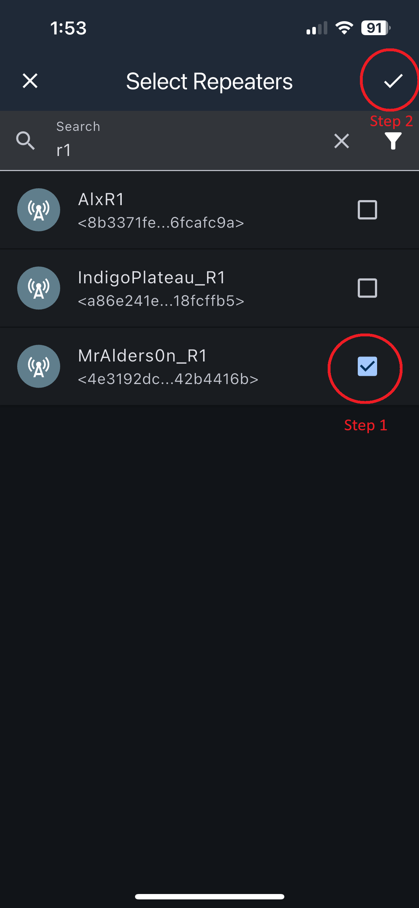
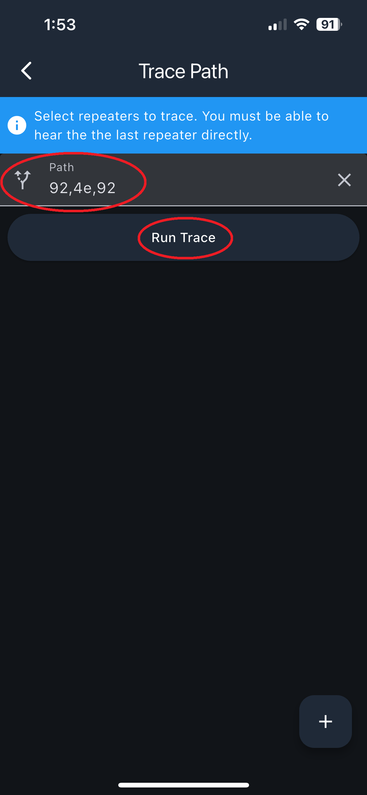

# MeshCore FAQ

This page covers frequently asked questions about using MeshCore in Ottawa.  
Each section provides quick guidance for common tasks.

---

## How Adverts Work

MeshCore uses a **repeater-driven advert system** for discovery (not a prerequisite to transmit).

- **You do not need to receive an advert from a repeater to send a message.**  
  You can transmit at any time; any repeater that hears your packet will forward it.

- Adverts allow your node to **discover repeaters** (their ID and info). This enables:
  - Tracing paths to confirm connectivity  
  - Seeing repeater names in message paths  
  - Setting static paths to a specific user

- Repeaters periodically broadcast **adverts** (short beacon packets).

- In Ottawa:
  - **Zero-hop adverts:** Every 1 hour  
  - **Flood adverts:** Every 3 hours  

---

## The Public Channel

All Ottawa MeshCore nodes have access to the **public channel**.

- Any correctly flashed node on the correct frequency can pass traffic.
- When you send a message and a repeater hears it, the app shows **Heard X Repeats**.
- Hold a message → tap **Heard Repeats** to see which repeaters heard it.
  - Known repeaters show **names**  
  - Unknown repeaters show **IDs**

---

## How to Share Your Contact URL

1. Open the MeshCore app and connect to your node.
2. Tap the **Signal** icon.  
   
3. Tap **Advert → To Clipboard**.  
   
4. Paste your contact URL anywhere you want to share it.

---

## How to Import a Contact URL

1. Open the app and connect to your node.
2. Tap the **three dots**.  
   
3. Tap **Add Contact**.  
   
4. Tap **Import from Clipboard Link**.  
   
5. After a few seconds you will see:  
   **"Success – contact has been imported"**  
   
6. A second popup appears:  
   **"New Contact Discovered <NAME>"**  
   
7. The contact is now added.

---

## How to Trace Route to a Node (1 Hop)

1. Open the app and connect.
2. Tap the **three dots**.  
   
3. Tap **Tools**.  
   
4. Tap **Trace Path – Manual**.  
   
5. Tap the **plus button**.  
   
6. Select a repeater and confirm.  
   
7. You will see one repeater ID — a **1-hop trace**.  
   
8. Tap **Trace Path**.

---

## How to Trace Route to a Node (2+ Hops)

1. Open the app and connect.
2. Tap the **three dots**.  
   
3. Tap **Tools**.  
   
4. Tap **Trace Path – Manual**.  
   
5. Tap the **plus button**.  
   

6. Select repeaters **in order**:
   - Choose the **forward path**  
   - Confirm  
   - Re-open the add menu and choose the **return path**
   - Or manually enter IDs:  
     Example: `d3, f3, d3`  
   

7. Confirm both forward and return paths, then tap **Trace**.  
   

8. View the results.  
   
